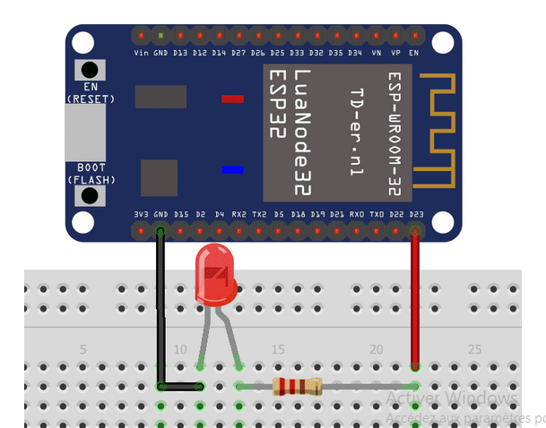

# Commande-une-LED-et-un-buzzer-avec-le-site
## Étape 1 : Ajouter les boutons dans la page data.php
- il faut rajouter dans la partie body un bouton **"Allumer"**
  Copiez le code dans la partie body

```html
<body>

    <PARTIE MESURE A LAISSER>

    <h1>Commande ESP32</h1>

    <button onclick="fetch('http://IP_ESP32/son')">
        🔆 Allumer la LED
    </button>

</body>
```
## Étape 2 : Ajouter un actionneur sur l’esp32
- Cette étape servira a tester le buzzer avec la LED
### Matériels à utiliser :
-	ESP32.
-	Grove buzzer
-	Une Resistance (à définir plus tard)
-	LED
-	Breadboard 

### 1 Test buzzer
- broche utiliser: VCC - 3.3V/ GND - GND/ SIG - GPIO26
    Copiez ce code dans votre Arduino :
```cpp
const int buzzer = 23;

void setup() {
  ledcAttach(buzzer, 2000, 8); // attach pin to channel
}

void loop() {
  ledcWriteTone(buzzer, 262); // Do
  delay(300);

  ledcWriteTone(buzzer, 294); // Ré
  delay(300);

  ledcWriteTone(buzzer, 330); // Mi
  delay(300);

  ledcWriteTone(buzzer, 0);   // stop
  delay(1000);
}
```
### 2 Test LED

